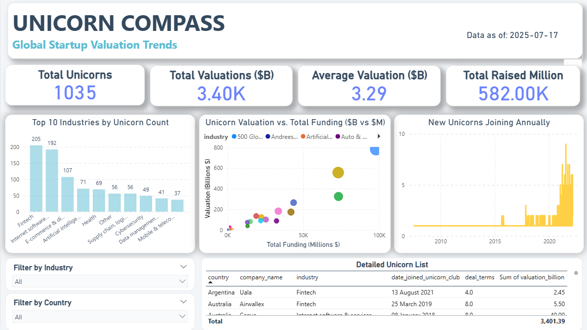

# Unicorn-Insights-ETL-PowerBI
An end-to-end data pipeline and Power BI dashboard for analyzing global unicorn companies.
# Unicorn Insights: Global Startup Valuation Trends

## Project Overview

This project delivers an end-to-end data analytics solution designed to extract, transform, load (ETL), and visualize key trends within the global unicorn startup ecosystem. Leveraging a robust Python-based pipeline and a PostgreSQL data warehouse, the project culminates in an interactive Power BI dashboard that provides actionable insights into unicorn valuations, industry distribution, geographical presence, and growth over time.

This project demonstrates proficiency across the entire data analytics lifecycle, from data ingestion and modeling to advanced visualization and UI/UX design.



## Business Value & Key Insights


* **Market Intelligence:** Gain a clear understanding of which industries are producing the most unicorns, their geographical concentrations, and how valuations are distributed.
* **Growth Trends:** Identify periods of significant unicorn growth and the average time it takes for startups to achieve unicorn status.
* **Investment Dynamics:** Explore the relationship between total funding raised and company valuation, and identify key investors (though detailed investor analysis would require more granular data).
* **Data-Driven Decision Making:** Provides a foundation for strategic planning, competitive analysis, and identifying emerging high-growth sectors.

## Technical Architecture & Components

The solution is built on a modern data stack, ensuring reliability, scalability, and efficient data processing.

### **1. Data Source**

* **`Unicorn_Companies.csv`**: A publicly available dataset containing details of global unicorn companies, sourced from platforms like Kaggle (often originally compiled from CB Insights). This file serves as the primary input for the ETL pipeline.

### **2. ETL Pipeline (Python)**

* **Language:** Python 3.x
* **Libraries:**
    * `pandas`: For robust data loading, cleaning, transformation, and manipulation.
    * `psycopg2`: PostgreSQL adapter for Python, enabling database connectivity.
    * `SQLAlchemy`: Python SQL Toolkit and Object Relational Mapper, used for efficient database interactions and managing connections.
    * `numpy`: Utilized for advanced numerical operations and handling of `NaN` values.
* **Key Processes:**
    * **Extraction:** Reads data directly from the `Unicorn_Companies.csv` file.
    * **Transformation:**
        * **Column Mapping & Renaming:** Standardizes CSV headers to clean, snake_case column names.
        * **Data Type Conversion:** Aggressively converts and validates data types (e.g., currency strings to floats, date strings to date objects, handling nullable integers).
        * **Missing Value Handling:** Implements comprehensive logic to convert `NaN`, `NaT`, `pd.NA`, empty strings, and string `'None'` to Python `None` for seamless database insertion.
        * **Feature Engineering:** Calculates `load_date` (date of data processing) for snapshot tracking.
    * **Loading:**
        * **PostgreSQL Integration:** Connects to a PostgreSQL database.
        * **Idempotent UPSERTs:** Utilizes `ON CONFLICT DO UPDATE SET` clauses for `dim_company`, `dim_date`, and `fact_unicorn_snapshot` tables to ensure data freshness and prevent duplicates upon re-runs.
        * **Error Resilience:** Employs **nested transactions** (`connection.begin_nested()`) for individual row inserts/updates, isolating data quality errors and preventing the entire batch from aborting.
        * **Automation:** The script runs in a continuous loop with a randomized delay (24-48 hours) between cycles, aligning with the typical update frequency of unicorn datasets.

### **3. Data Warehouse (PostgreSQL)**

* **Database:** PostgreSQL
* **Schema Design:** Implements a **Star Schema** for optimal analytical performance and clear data relationships.
    * **`dim_date`**: Dimension table for dates (`date_key`, `full_date`, `year`, `month`, `day`, `day_of_week`, `is_weekday`).
    * **`dim_company`**: Dimension table for unique companies (`company_key`, `company_name`, `industry`, `country`, `city`, `founded_year`, `date_joined_unicorn_club`, `select_investors`).
    * **`fact_unicorn_snapshot`**: Fact table storing key metrics (`snapshot_id`, `load_date_key`, `company_key`, `valuation_billion`, `total_raised_million`, `financial_stage`, `investors_count`, `deal_terms`, `portfolio_exits`).

### **4. Business Intelligence Dashboard (Power BI)**

* **Tool:** Microsoft Power BI Desktop
* **Connection Mode:** **Import Mode** (for fast interaction and full DAX capabilities, suitable for daily/weekly data updates).
* **Dashboard Name:** "Unicorn Compass"
* **UI/UX & Visual Design:**
    * **Aesthetic:** Clean, modern, and inviting, featuring a "Serene Gradient" color palette (`#F3F6F9` canvas, `#FFFFFF` visuals, `#6A82FB` primary accent, `#5DBCD2` secondary accent, `#FFC107` tertiary accent, `#34495E` dark text).
    * **Smoothness:** Emphasizes rounded corners (15px radius) and subtle shadows (`rgba(0,0,0,0.08)`) on all visual elements for a soft, elevated feel.
    * **Key Visuals:**
        * **Header:** Dynamic title, subtitle, and "Data as of: YYYY-MM-DD" timestamp.
        * **KPI Cards:** High-level metrics (Total Unicorns, Total Valuation, Avg. Valuation, Avg. Time to Unicorn) for quick insights.
        * **"Top Industries by Unicorn Count" (Column Chart):** Visualizes industry distribution.
        * **"New Unicorns Joining Annually" (Line Chart):** Tracks growth trends over time.
        * **"Unicorn Valuation vs. Total Funding ($B vs $M)" (Scatter Chart):** Explores correlations between funding and valuation, with points colored by industry.
        * **Interactive Slicers:** Dropdown filters for `Industry` and `Country` enabling user self-service analysis.
        * **"Detailed Unicorn List" (Table):** Provides granular company-level data.

## Challenges & Solutions

This project provided valuable experience in overcoming practical data engineering challenges:

* **Data Type Mismatches & `NaN`/`NaT` Handling:** Systematically addressed persistent `psycopg2` errors (`can't adapt type 'NAType'`, `NumericValueOutOfRange`) by implementing a multi-layered approach to convert all Pandas missing value types (`np.nan`, `pd.NA`, `pd.NaT`) and string representations of `None` to Python `None` before database insertion.
* **Foreign Key Violations (`ForeignKeyViolation`):** Resolved issues where `company_key` was `NaN` or invalid, leading to `ForeignKeyViolation` in the fact table. This was achieved by introducing **nested transactions** for each `dim_company` insert/update, ensuring that if a company record failed, its `company_key` was explicitly set to `None` in the DataFrame, and corresponding fact rows were gracefully skipped.
* **Python `date` vs. Pandas `datetime64` (`.dt` accessor error):** Overcame errors related to inconsistent date object types by explicitly managing `load_date` as a Python `date` object and extracting its components using direct Python attributes (e.g., `d.year`) for `dim_date` loading, bypassing problematic Pandas `.dt` accessor behavior.
* **Robust ETL Automation:** Developed a resilient automation loop with randomized delays and comprehensive `try-except` blocks to handle file reading errors, data transformation issues, and database loading failures, ensuring continuous pipeline operation.

## How to Run This Project

### **Prerequisites:**

* Python 3.x installed (with `pip` in PATH)
* PostgreSQL installed and running (with `pgAdmin 4` for management)
* Microsoft Power BI Desktop installed

### **Setup Steps:**

1.  **Clone this Repository:**
    ```bash
    git clone [https://github.com/YourUsername/Unicorn-Insights-ETL-PowerBI.git](https://github.com/YourUsername/Unicorn-Insights-ETL-PowerBI.git)
    cd Unicorn-Insights-ETL-PowerBI
    ```
    *(Replace `YourUsername` and `Unicorn-Insights-ETL-PowerBI` with your actual GitHub details)*

2.  **Install Python Libraries:**
    ```bash
    pip install pandas psycopg2-binary SQLAlchemy numpy
    ```

3.  **Download Data:**
    * Download the `Unicorn_Companies.csv` file from [Kaggle](https://www.kaggle.com/datasets/ramjasmaurya/unicorn-companies) (or the source you used).
    * Place the downloaded `Unicorn_Companies.csv` file directly into this project directory.

4.  **PostgreSQL Database Setup:**
    * Open `pgAdmin 4` and connect to your PostgreSQL server.
    * Create a new database named `unicorn_db`.
    * Open a Query Tool connected to `unicorn_db` and execute the SQL commands provided in `unicorn_schema.sql` (also in this repository) to create the `dim_date`, `dim_company`, and `fact_unicorn_snapshot` tables.

5.  **Configure Python Script:**
    * Open `unicorn_extractor.py` in a text editor.
    * **Update `DB_PASSWORD`** on line 23 with your actual PostgreSQL password.

6.  **Run the ETL Pipeline:**
    * Open your Command Prompt.
    * Navigate to this project directory.
    * Run the script:
        ```bash
        python unicorn_extractor.py
        ```
    * Let it run for a few minutes to load all the data. You can stop it with `Ctrl + C` after the first full cycle.

7.  **Connect Power BI:**
    * Open Power BI Desktop.
    * Go to "Get data" -> "PostgreSQL database".
    * Enter `Server: localhost`, `Database: unicorn_db`. Choose **"Import"** mode.
    * Enter `Username: postgres` and your PostgreSQL password.
    * Select `dim_date`, `dim_company`, and `fact_unicorn_snapshot` tables and click "Load".
    * Verify relationships in the Model View.

8.  **Build the Dashboard:**
    * Follow the UI/UX design and visual elements described in this README (or the detailed guide provided during our chat) to build the "Unicorn Compass" dashboard.
    * Refresh Power BI data (Home tab -> Refresh) after each ETL run to see updates.

## Future Enhancements

* **Automated Data Refresh:** Implement scheduled refreshes for the Power BI dashboard in Power BI Service (requires Pro license).
* **More Granular Data:** Explore additional data points like specific funding round details, lead investors, or founder information.
* **Advanced Analytics:** Develop DAX measures for year-over-year growth, market share changes, or predictive modeling (e.g., predicting time to IPO).
* **Interactive Map:** Integrate a map visual to show unicorn distribution by city/country more dynamically.
* **Web-based ETL Trigger:** Create a simple web interface or use a task scheduler (e.g., Windows Task Scheduler, Apache Airflow) to trigger the Python script automatically.
* **Cloud Deployment:** Deploy the PostgreSQL database and Python script to a cloud platform (AWS RDS/EC2, Azure Database/VM, Google Cloud SQL/Compute Engine).

---
